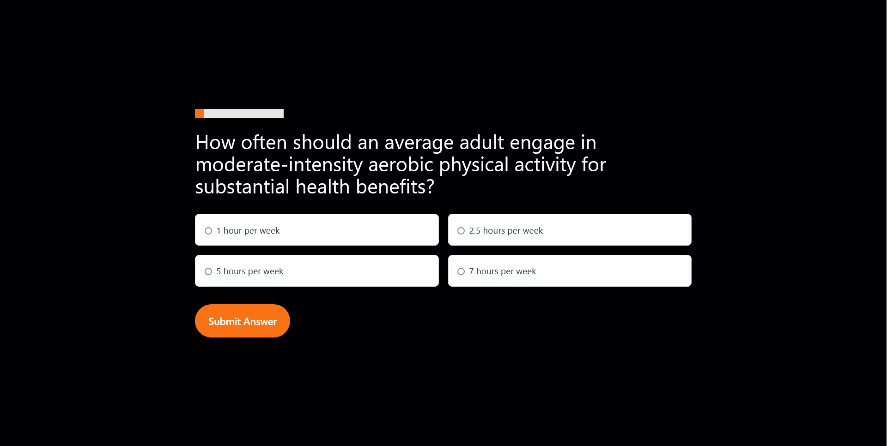

## Overview

The Fitness Quiz Application is an interactive web-based quiz designed to test and enhance users' knowledge about fitness and healthy living. Built with modern web technologies, including React and Astro, the application provides an engaging user experience with dynamically rendered questions, instant feedback, and progress tracking.

### The challenge

Users should be able to:

- Select and Submit Answers
- Receive Instant Feedback
- Navigate Through Questions
- Track Their Progress
- View Their Final Score
- Restart the Quiz
- Take the Quiz on Any Device

### Screenshot

### Links

- Live Site URL: [https://fitnessquiz.netlify.app/quiz/](https://fitnessquiz.netlify.app/quiz/)

### Technologies Used

- Astro: For static site generation and fast, optimized web performance.
- React: For dynamic user interfaces and component-based architecture.

## Author

- Website - [Aleksi Liukkonen](https://www.aleksiliukkonen.fi)
